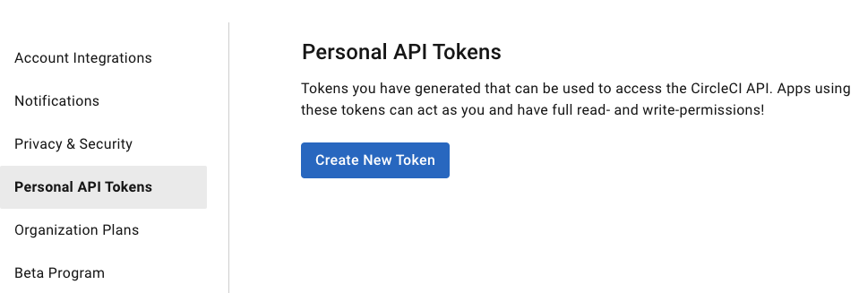
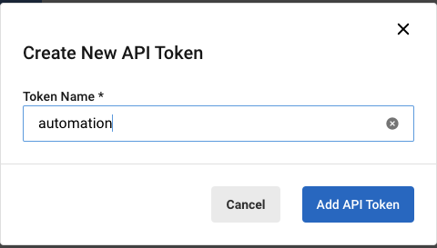
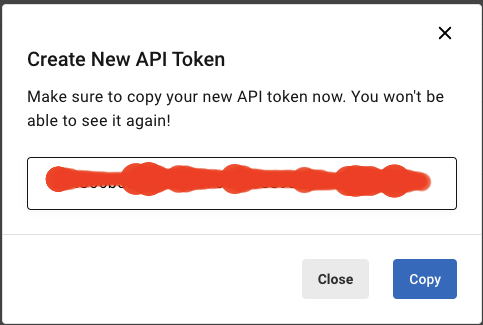

# CircleCI

To create a personal API token, browse to CircleCI [User Settings](https://app.circleci.com/settings/user/tokens) and
select `Personal API Tokens` from the menu.

Click the `Create New Token` Button.

Give the Token a Name:

and then you will be presented with a value, do not share this with anyone, and keep it safe, as you will need it for
the automation.

If you forget or misplace the token value, you will need to create a new one. You will need this value for the build
script.