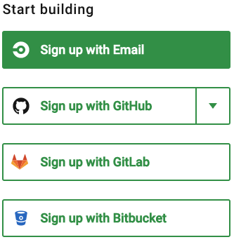
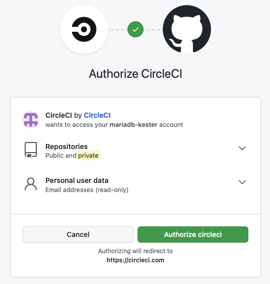
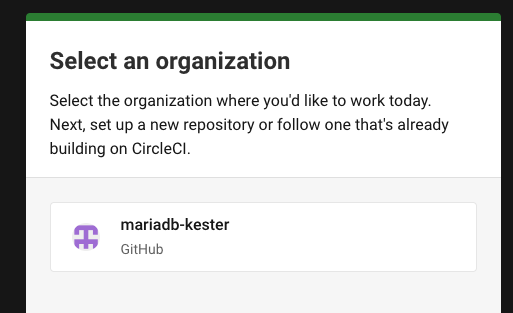

# CircleCI

CircleCI is a free tool, that can be used to build your required packages. There are various offerings, but CircleCI
works perfectly and is one of the better ones.

### To Create a DigitalOcean Account

Browse to the [CircleCI WebPage](https://circleci.com) and select 'Sign up':

From here you will be asked to Create an Account. Before you do this, ensure you already have
a [GitHub](../github/readme.md) Account, and select the 'Sign up with GitHub' option, selecting the dropdown box and
choosing 'All Repos':

You will then be asked to Authorise your connectivity to GitHub, this works best if you have GitHub open and logged in
from another tab in your web browser.

Once you have authorised your account with GitHub, you will be asked to complete some questions on your intended use of
the product. It does not really matter what you select here:

Next you will need to select the GitHub organisation you intend to use:

Finally, select the 'Skip setup' option form the bottom of the screen:

This is all you need to do for now, we will come back to CircleCI later.