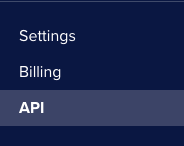
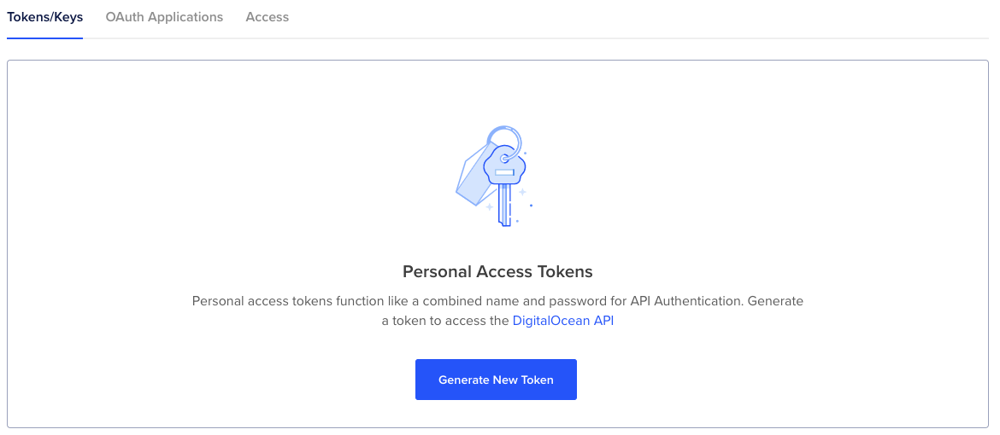
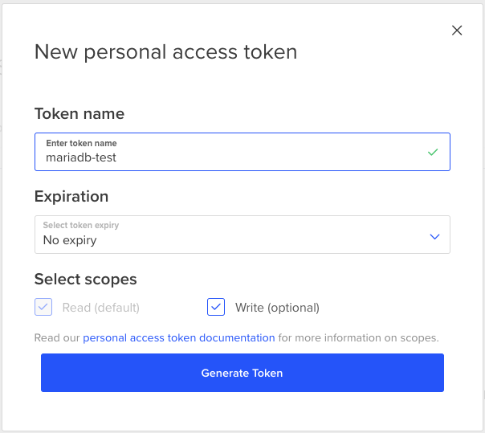
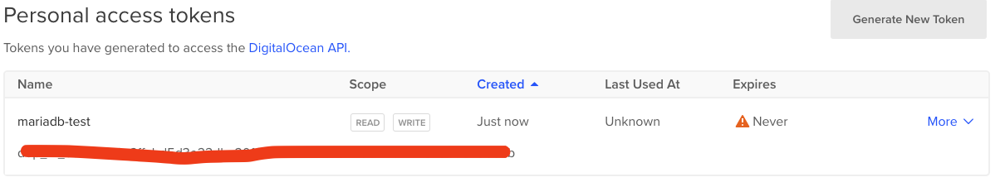

# DigitalOcean

## API Key

to be able to communicate with DigitalOcean, you require an API key. DigitalOcean provides a Client utility called
`doctl` however, we won't be using that for this demonstration.

Instead, browse to [DigitalOcean](https://digitalocean.com) and login if required, using your GitHub credentials.

Scroll down the menu on the left hand side, until you locate the API menu option:

On the new page that opens, ensure you select Tokens/Keys:

and select the Generate New Token option.

Whilst DigitalOcean offer you $200 dollars for free, you will need to give them some kind of payment option:

Do not worry though, you can close your account and not get charged, just as soon you have completed the demonstration.

Go ahead and setup a payment method and then you can create the token.

You will be given the key, it is important you copy this and keep it safe and secure, you will not be able to view this
key again. Please treat this as highly personal information and if people have access to this, they will be able to use
your account.

You will need to use this key as part of the Terraform setup. 