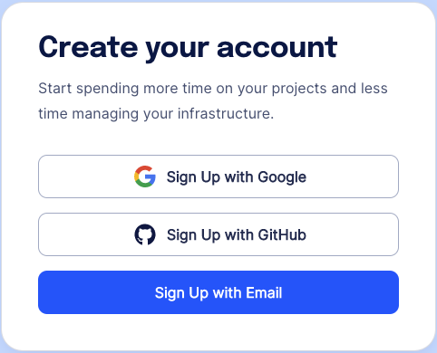
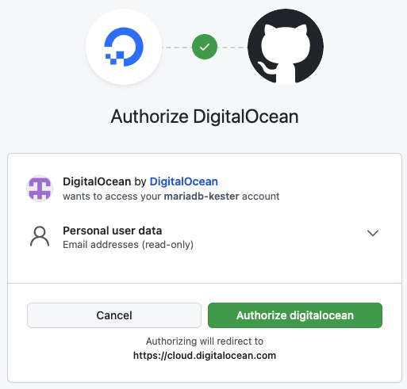
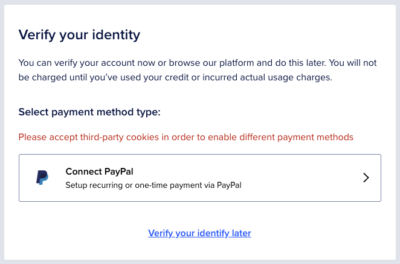
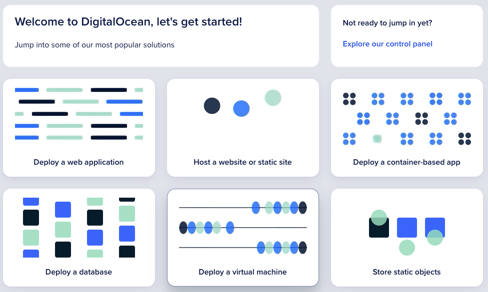

# DigitalOcean

DigitalOcean is a great cloud hosting provider, it is simple to use, reliable and a perfect place for hosting your
systems.

They also give you $200 dollars of credit when you first create your account, which is valid for 60 days.

### To Create a DigitalOcean Account

Browse to the [DigitalOcean WebPage](https://m.do.co/c/902b9dbb0402) and select 'Sign up':

From here you will be asked to Create an Account. Before you do this, ensure you already have
a [GitHub](../github/readme.md) Account, and select the 'Sign up with GitHub' option:

You will then be asked to Authorise your connectivity to GitHub, this works best if you have GitHub open and logged in
from another tab in your web browser.

Once you have authorised your account with GitHub, you will be asked to verify your account, for now just select the
'Verify your identity later' option:

Finally, select the 'Explore our control panel' option form the top left of the screen:

This is all you need to do for now, we will come back to Digital Ocean later.