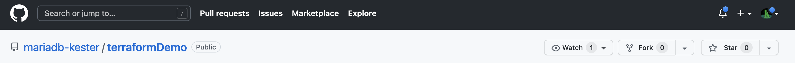
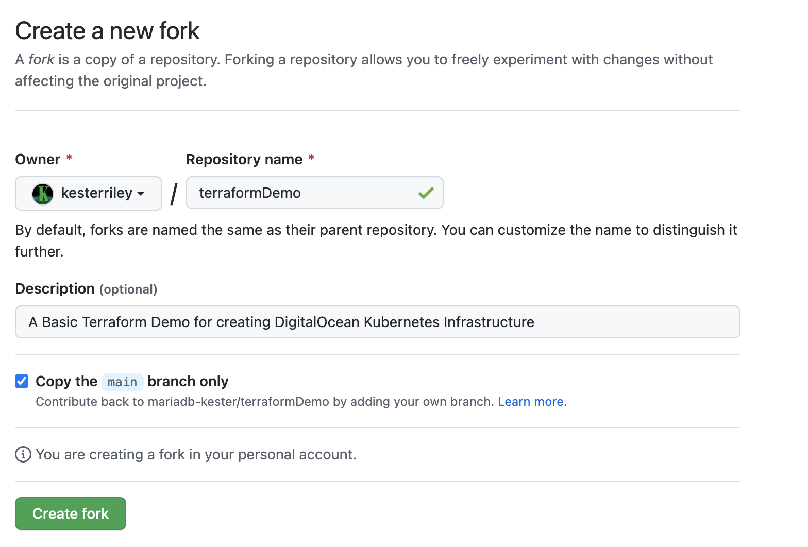

# GitHub

_A fork is a copy of a repository that you manage. Forks let you make changes to a project without affecting the
original repository. You can fetch updates from or submit changes to the original repository with pull requests._

### GitHub Fork

To allow you to use, maintain and adjust the projects; and to be able to track your own history,you will need to fork
the following repositories.

- https://github.com/mariadb-kester/terraformDemo
- https://github.com/mariadb-kester/mariadbServerDocker
- https://github.com/mariadb-kester/mariadbMaxscaleDocker
- https://github.com/mariadb-kester/phpAppDocker

Ensure you are logged in to GitHub and then visit each of the listed URL. (The details will be different for each
repository)

To do this, browse to the URL in a new tab and select the fork option. You will be given some options, keep them as
default.

Click the Create fork button and the system will fork the repository.