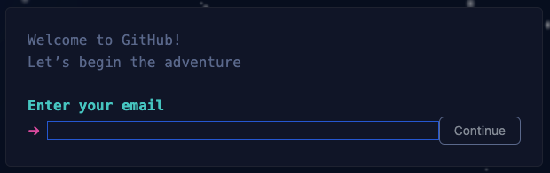

# GitHub

If you do not have a GitHub account, you should create one. These are free to create and GitHub has a fun signup
process.

### Signup to GitHub

Browse to [GitHub](https://www.github.com) and select the signup option.

Follow the on screen prompts to create your account, this will generate various emails and verification so ensure you
use a valid email address.

Once you have created a GitHub account, you will need to fork the required repositories in to your GitHub account.

